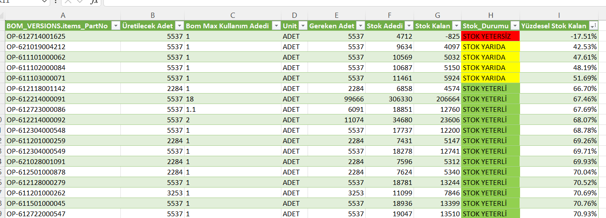

# Smart-MRP-Inventory-Management-System

## 🎯 Overview
This project is an automated **Material Requirements Planning (MRP)** system built entirely within Excel using **Power Query**. It bridges the gap between production planning and warehouse management by calculating real-time material shortages based on active work orders and Bill of Materials (BOM).

---

## 🛠 How It Works (The Logic)
I developed a relational data model that connects three separate data silos to automate the following process:

1. **Production Planning:** Calculating net production demand by subtracting completed and reworked units from total active work orders (`Planlanan - (Passed + Rework)`).
2. **Bill of Materials (BOM):** Mapping active work orders to their respective BOM versions to determine precise material requirements per phone.
3. **Inventory Mapping:** Integrating real-time warehouse stock levels to analyze against material requirements.
4. **Gap Analysis:** Calculating total needed vs. available stock (`Stok Kalan = Stok Adedi - Gereken Adet`) to determine the exact shortage or surplus.

### 🔄 The ETL Process (Power Query)
* **Data Merging:** Connected `WorkordersAndMaterials`, `BOM_VERSIONS`, and `STOK` tables using unique Part Numbers and Version IDs.
* **Dynamic Calculation:** Automated `Required Amount` calculation by multiplying `Production Quantity` x `BOM Usage Unit`.

---

## 📊 Key Features & Visuals
### 1. Automated Stock Status
The system categorizes stock health into **five** distinct visual alerts to prioritize purchasing and production actions:

- ⚪ **STOK YOK (Out of Stock):** No physical inventory available in the warehouse.
- 🔴 **STOK YETERSİZ (Shortage):** Current stock is below the required amount for active work orders.
- 🟠 **STOK BİTMEK ÜZERE (Critical Level):** Stock is available but will reach zero shortly (Running low).
- 🟡 **STOK YARIDA (Warning):** Stock level is moderate but requires monitoring.
- 🟢 **STOK YETERLİ (Healthy):** Sufficient inventory to fulfill all requirements.

>  
> *Caption: Real-time inventory status mapping with conditional formatting.*

### 2. Data Pipeline
By utilizing **Applied Steps** in Power Query, the report refreshes with a single click whenever a new work order or stock update is received.

---

## 📈 Business Impact
- **Risk Mitigation:** Identifies shortages before production begins, preventing costly downtime.
- **Efficiency:** Replaced manual Excel lookups with an automated ETL pipeline, reducing reporting time by 90%.
- **Decision Support:** Provides purchasing teams with precise "Net Requirement" data.

---

**Author:** [Nilay Özel]

**Connect with me:** [https://www.linkedin.com/in/nilay-%C3%B6zel-2927a7210/]
